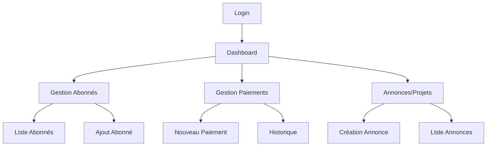

# Documentation des Interfaces Utilisateur

## 1. User Stories & Exigences Fonctionnelles

### Rôle Administrateur
```yaml
stories:
  - en_tant_que: Administrateur
    je_veux: 
      - Créer/Modifier/Supprimer des abonnés
      - Gérer les plans mensuels
      - Enregistrer les paiements
      - Créer des annonces/projets
      - Voir les statistiques globales
    afin_de: Gérer efficacement les cotisations de la cité

  - en_tant_que: Abonné
    je_veux:
      - Voir mes cotisations
      - Consulter mon historique de paiements
      - Voir les annonces
      - Être notifié des nouvelles charges
    afin_de: Suivre mes obligations financières
```

## 2. Wireframes et Maquettes

### Interface Web Admin
```yaml
pages:
  dashboard:
    components:
      - Statistiques globales (KPIs)
      - Graphique des paiements mensuels
      - Liste des derniers paiements
      - Alertes et notifications
    actions:
      - Filtrer par période
      - Exporter les données

  gestion_abonnes:
    components:
      - Table des abonnés avec recherche
      - Formulaire création/modification
      - Filtres par bloc/statut
    actions:
      - CRUD abonnés
      - Import/Export données

  gestion_paiements:
    components:
      - Formulaire de paiement
      - Historique des transactions
      - État des cotisations
    actions:
      - Enregistrer paiement
      - Générer reçu
      - Marquer comme payé
```

## 3. Flow de Navigation

### Web Application


## 4. Spécifications des Composants UI

### Composants Réutilisables
```typescript
interface DataTableProps {
  data: any[];
  columns: Column[];
  pagination?: boolean;
  actions?: TableAction[];
}

interface DashboardCardProps {
  title: string;
  value: number | string;
  icon?: IconType;
  trend?: {
    value: number;
    direction: 'up' | 'down';
  };
}

interface FilterBarProps {
  filters: Filter[];
  onFilterChange: (filters: Filter[]) => void;
}
```

## 5. États et Gestion des Données

```typescript
// État Global (Redux/Context)
interface AppState {
  user: {
    currentUser: User | null;
    isAuthenticated: boolean;
  };
  cotisations: {
    items: Cotisation[];
    loading: boolean;
    error: string | null;
  };
  notifications: {
    items: Notification[];
    unreadCount: number;
  };
}

// Actions
enum ActionTypes {
  FETCH_COTISATIONS = 'FETCH_COTISATIONS',
  ADD_PAYMENT = 'ADD_PAYMENT',
  UPDATE_USER = 'UPDATE_USER',
}
```

## 6. Validation des Formulaires

```yaml
forms:
  creation_abonne:
    fields:
      - name: username
        type: text
        required: true
        validation: "^[a-zA-Z0-9_]{3,20}$"
      
      - name: email
        type: email
        required: true
        validation: "email"

      - name: bloc
        type: select
        options: [A, B, C, D]
        required: true

      - name: nombre_voitures
        type: number
        min: 0
        max: 5
```

## 7. Messages et Notifications

```yaml
notifications:
  types:
    - success:
        color: green
        icon: check
        duration: 3000
    
    - error:
        color: red
        icon: x
        duration: 5000

    - warning:
        color: orange
        icon: alert
        duration: 4000

messages:
  payment_success: "Paiement enregistré avec succès"
  payment_error: "Erreur lors du paiement"
  login_required: "Veuillez vous connecter"
```
